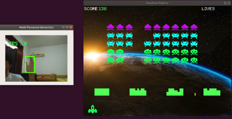

## Demo

This is a course project of CS4186.

There is the [installation guide](https://github.com/RKLho/hand_detection_spaceinvader/blob/master/installation_guide.md)

## Reference
[Hand tracking](https://github.com/victordibia/handtracking)

[Space invaders](https://github.com/leerob/Space_Invaders)

The licenses of related project are in docs directory

## Contributors:
- LI Ruikang
- Ilias Batyrbekov
- Qu Yang 
